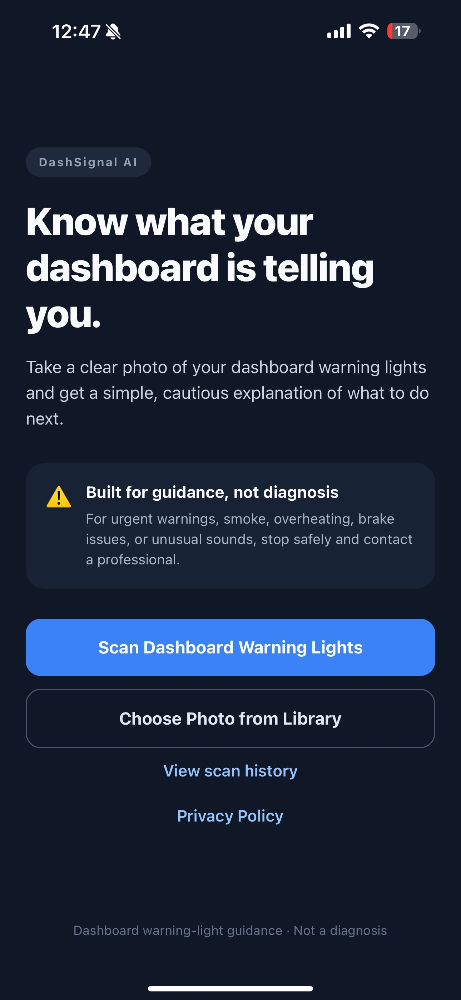
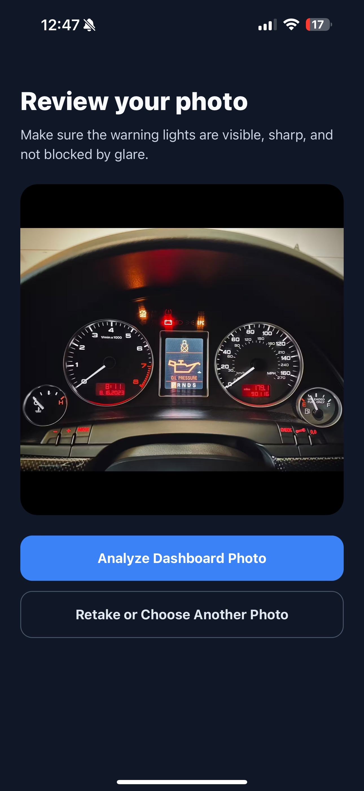
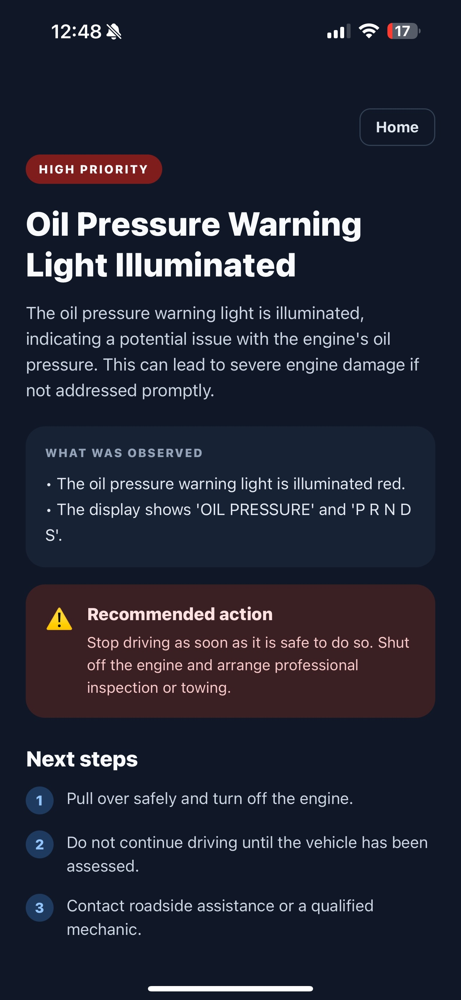
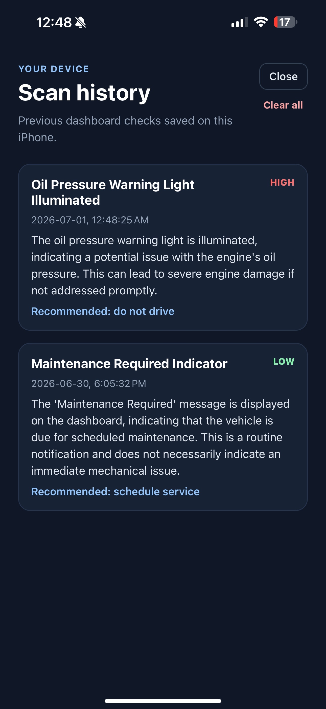

# DashSignal AI

A safety-focused iOS dashboard warning-light guidance app built with React Native, Expo, TypeScript, Supabase Edge Functions, and Gemini Vision AI.

DashSignal AI lets users take or select a dashboard photo, analyzes visible warning indicators, and returns cautious next-step guidance. It is designed to explain what is visibly shown in the image—not to diagnose a vehicle or replace a mechanic.

## App Walkthrough

<p align="center">
  
  
  
</p>

<p align="center">
  
  
</p>

## Features

* Take a dashboard photo using the phone camera
* Select a dashboard photo from the device library
* Preview and retake images before analysis
* Analyze visible dashboard warning indicators with Gemini Vision AI
* Detect unsupported images that are not vehicle dashboards
* Handle unclear or insufficient dashboard images
* Classify visible warning indicators by severity
* Apply conservative safety overrides for critical warnings
* Return plain-language explanations and next steps
* Save scan results locally on the device
* Clear locally saved scan history
* Show first-use consent and privacy disclosures
* Open an in-app Privacy Policy page
* No visible signup or password required

## Current User Flow

```text
First-Use Consent
→ Home
→ Take Photo or Choose from Library
→ Review Photo
→ Anonymous Supabase Session
→ Supabase Edge Function
→ Gemini Vision Analysis
→ Safety Rules Applied
→ Result Screen
→ Optional Local Scan History
```

## Safety-First Design

This project intentionally focuses only on visible dashboard warning indicators.

The app does not:

* Diagnose an exact mechanical failure
* Guess unseen vehicle problems
* Estimate repair costs
* Read fault codes
* Guarantee that a vehicle is safe to drive
* Replace a qualified mechanic, roadside assistance, or emergency services

For critical visible indicators such as oil-pressure, brake, or overheating warnings, the backend applies conservative safety guidance regardless of the model's wording.

## Result States

### Critical Warning

For clearly visible critical indicators, the app can return:

* High-priority severity
* Do not drive guidance
* Immediate next steps such as pulling over safely and arranging professional inspection or towing

### No Visible Warning Indicators

When no warning lights are visible, the app states only that no visible warning indicators were identified in the photo.

It does not claim that the vehicle is safe or free of mechanical problems.

### Unsupported Photo

When the image is not a vehicle dashboard, the app returns:

* Unsupported photo
* Dashboard not detected
* Instructions to upload a clear dashboard image

### Insufficient Image

When the dashboard is blurry, cropped, obscured, or unreadable, the app asks the user to retake the image instead of guessing.

## Tech Stack

### Mobile App

* React Native
* Expo
* TypeScript
* Expo Image Picker
* Expo File System
* AsyncStorage

### Backend and AI

* Supabase Edge Functions
* Supabase Anonymous Authentication
* Gemini Vision AI
* Structured JSON responses
* Server-side safety overrides

## Architecture

```text
Mobile App
  ↓
Anonymous Supabase Session
  ↓
Supabase Edge Function
  ↓
Gemini Vision API
  ↓
Structured JSON Response
  ↓
Safety Overrides
  ↓
Mobile Result Screen
  ↓
Optional Local Scan History
```

The Gemini API key is stored only as a Supabase Edge Function secret.

It is not included in:

* The mobile app
* The GitHub repository
* The README
* Local source files committed to Git

## Project Structure

```text
App.tsx
  Mobile interface, image flow, consent gate, history, and result presentation

lib/supabase.ts
  Supabase client and anonymous session configuration

lib/history.ts
  Local scan-history storage and clearing logic

lib/consent.ts
  First-use consent storage and retrieval

supabase/functions/analyze-dashboard/index.ts
  Edge Function that validates images, calls Gemini, applies safety rules,
  and returns structured analysis results

privacy.html
  Public Privacy Policy hosted through GitHub Pages
```

## Local Setup

### 1. Install dependencies

```bash
npm install
```

### 2. Add local environment variables

Create a `.env` file in the project root:

```env
EXPO_PUBLIC_SUPABASE_URL=your-supabase-project-url
EXPO_PUBLIC_SUPABASE_PUBLISHABLE_KEY=your-supabase-publishable-key
```

Do not commit `.env`.

### 3. Configure Supabase

Create a Supabase project and configure:

* Anonymous sign-ins enabled
* An `analyze-dashboard` Edge Function
* A `GEMINI_API_KEY` Edge Function secret

### 4. Run the app

```bash
npx expo start
```

Then scan the Expo QR code with an iPhone or Android device.

## Testing Performed

The current version has been tested with:

* A visible red oil-pressure warning
* Dashboard maintenance reminders
* A dashboard with no illuminated warning indicators
* A non-dashboard photo
* Local scan-history saving and clearing
* First-use consent behavior
* Privacy Policy access
* Signed iOS TestFlight deployment

Expected behavior:

```text
Critical warning
→ High priority and conservative “do not drive” guidance

No visible warning lights
→ Assessment limited, without a safety guarantee

Non-dashboard image
→ Unsupported photo and dashboard retake guidance
```

## Future Improvements

* Better image-quality checks before AI analysis
* Additional warning-light categories
* Rate limiting for broader public use
* Accessibility improvements
* Automated tests for edge-case photo results
* Optional user accounts and cloud-backed history
* Paid AI-service tier for higher usage limits

## Author

Built by Thanushai as a portfolio project demonstrating mobile development, backend integration, AI vision workflows, secure API design, local persistence, privacy-aware product design, and safety-focused UX.
